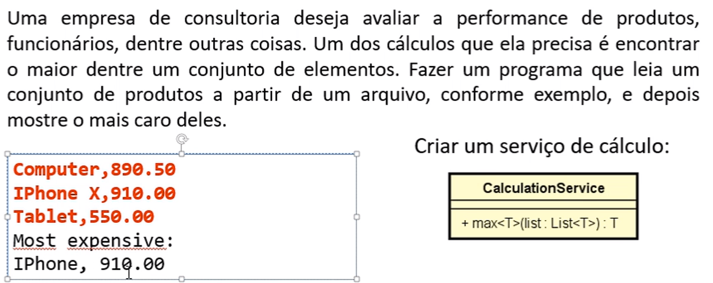
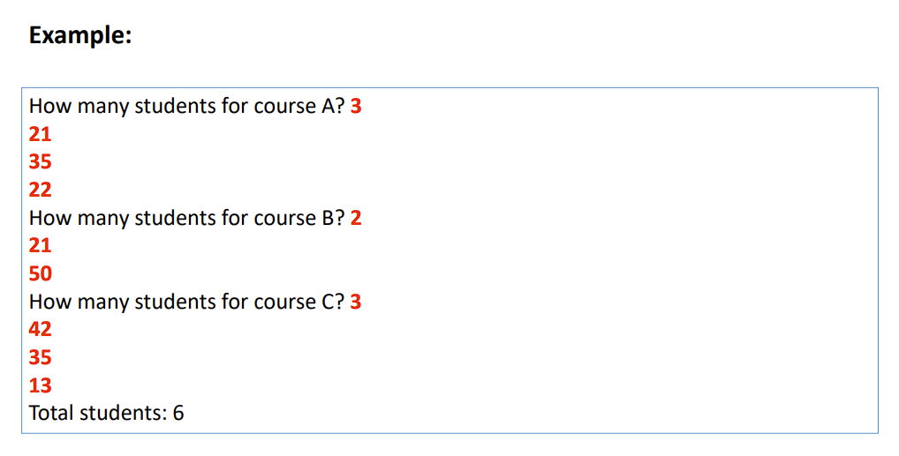
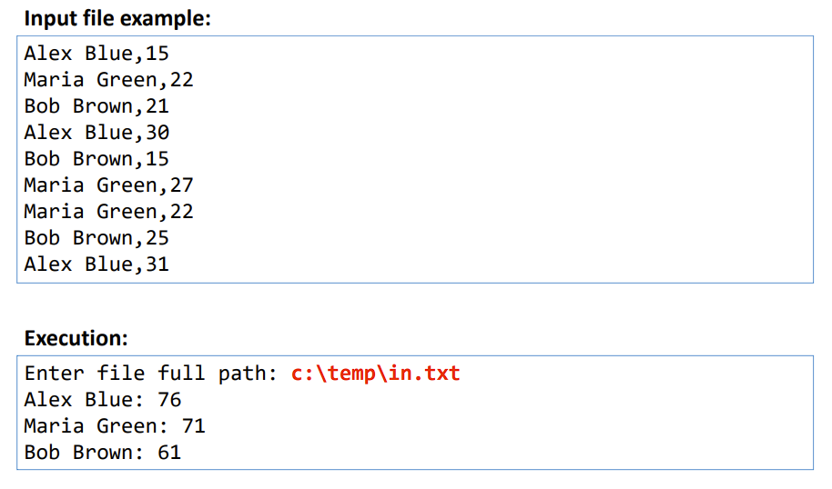

# Exercícios de Fixação - Generic, Set, Map

### - Exercício 1 - Generic

### - Exercício 2 - Set
Em um portal de cursos online, cada usuário possui um código único, representado por
um número inteiro.
Cada instrutor do portal pode ter vários cursos, sendo que um mesmo aluno pode se
matricular em quantos cursos quiser. Assim, o número total de alunos de um instrutor não
é simplesmente a soma dos alunos de todos os cursos que ele possui, pois pode haver
alunos repetidos em mais de um curso.
O instrutor Alex possui três cursos A, B e C, e deseja saber seu número total de alunos.
Seu programa deve ler os alunos dos cursos A, B e C do instrutor Alex, depois mostrar a
quantidade total e alunos dele.

Exemplo de Resposta de saída:

### - Exercício 3 - Map
Na contagem de votos de uma eleição, são gerados vários registros
de votação contendo o nome do candidato e a quantidade de votos
(formato .csv) que ele obteve em uma urna de votação. Você deve
fazer um programa para ler os registros de votação a partir de um
arquivo, e daí gerar um relatório consolidado com os totais de cada
candidato.

Exemplo de Resposta de saída:
